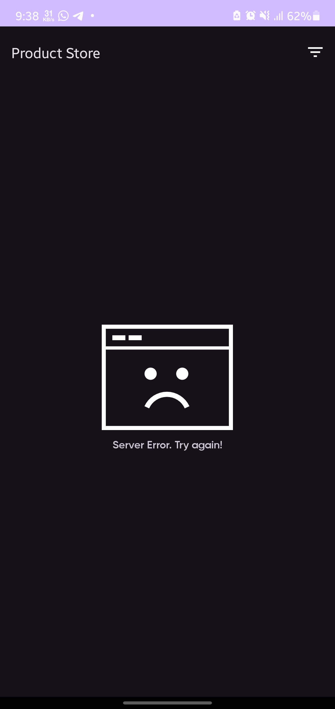
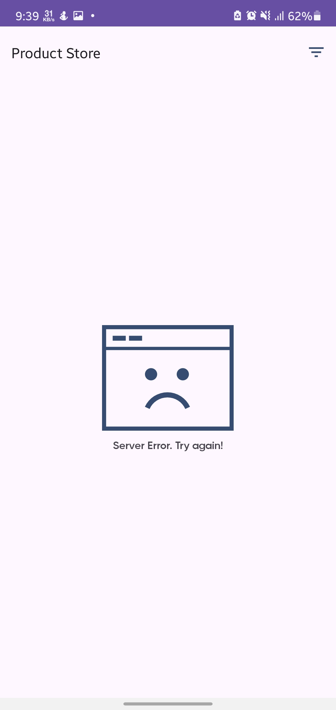
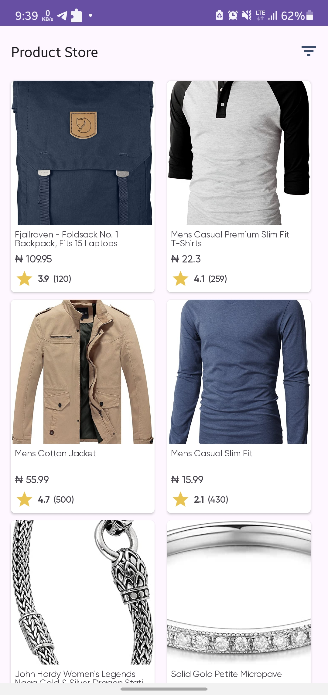
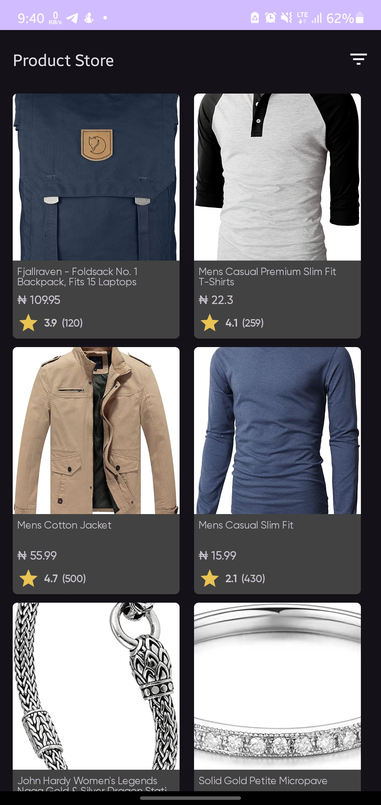
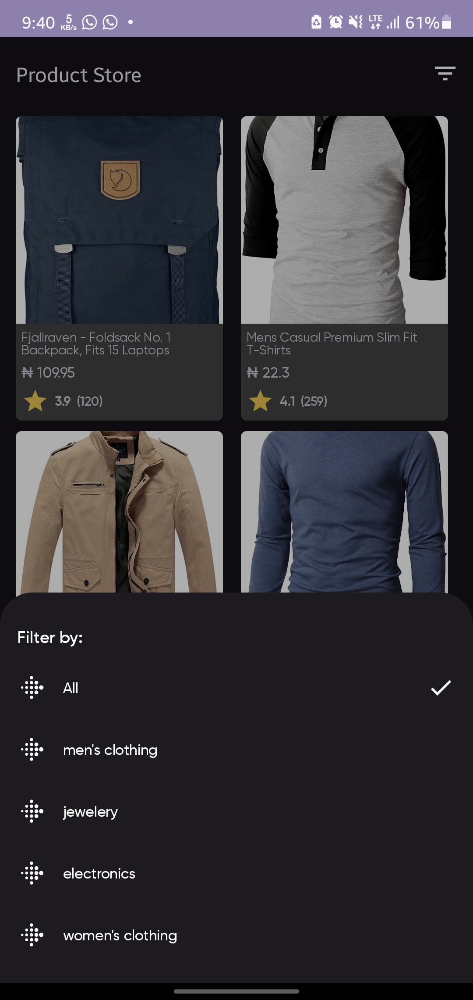
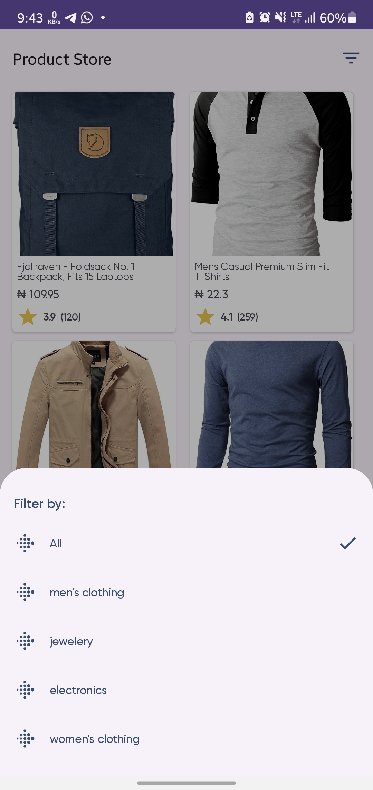
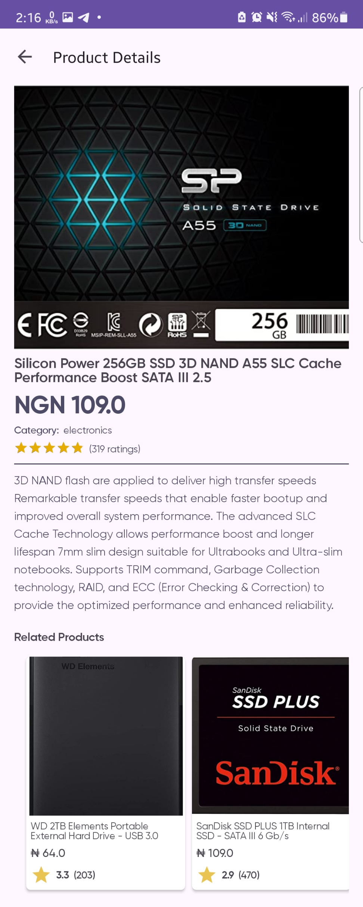
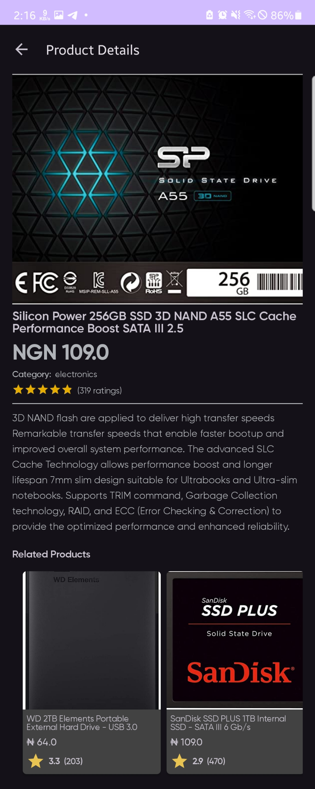

<h1>Product Explorer App</h1>

<h2>Overview</h2>

The <strong>Product Explorer</strong> app allows users to view a list of products, filter them based on categories, and view detailed information about each product. The app communicates with the Fake Store API to fetch product data, stores it locally using Room for offline use, and implements a clean architecture using <strong>MVVM</strong>, <strong>Flow</strong>, and <strong>Hilt</strong> for dependency injection.

<h2>Features</h2>
<ul>
    <li><strong>Product List Screen</strong>: Displays a list of products fetched from the API or local database.</li>
    <li><strong>Product Details Screen</strong>: Shows detailed information about a selected product.</li>
    <li><strong>Filter by Category</strong>: Users can filter products based on their category.</li>
    <li><strong>Related product</strong>: Users can see related products of same category to the selected product.</li>
</ul>

<h2>Screenshots</h2>

 

<strong>Product List</strong>

<strong>Product Details</strong>

<strong>Product Details</strong>

<strong>Product Details</strong>

<strong>Product Details</strong>

<strong>Product Details</strong>

<strong>Product Details</strong>

<strong>Product Details</strong>

<h2>Prerequisites</h2>

To run this project locally, ensure you have the following:

<ul>
    <li><strong>Android Studio</strong> installed.</li>
    <li><strong>Kotlin</strong> installed.</li>
    <li><strong>Gradle</strong> configured for your project.</li>
</ul>

<h2>Installation</h2>

Follow the steps below to run the <strong>Product Explorer</strong> app on your local machine.

<h3>1. Clone the Repository</h3>

Clone the repository to your local machine using the following command:

<pre><code>git clone https://github.com/lexmerciful/product-explorer.git</code></pre>

<h3>2. Open the Project</h3>

Open Android Studio and select <strong>Open an existing project</strong>, then navigate to the folder where you cloned the repository.

<h3>3. Sync Gradle</h3>

Once the project is loaded in Android Studio, sync the Gradle files to ensure all dependencies are downloaded.

<h3>5. Build and Run</h3>
<ul>
    <li>Select a device (either an emulator or a physical device) and click the <strong>Run</strong> button in Android Studio.</li>
    <li>The app will compile and launch on your selected device.</li>
</ul>

<h2>Architecture</h2>

The app is built using the <strong>MVVM (Model-View-ViewModel)</strong> architecture. The flow of data is managed using <strong>Kotlin Flows</strong> and <strong>StateFlow</strong> for reactivity. Dependency injection is handled via <strong>Hilt</strong> for modularity and ease of testing.

<h3>Components</h3>
<ul>
    <li><strong>Model</strong>: Represents the data structure for products.</li>
    <li><strong>ViewModel</strong>: Contains business logic for fetching products, filtering them, and exposing data to the UI.</li>
    <li><strong>Repository</strong>: Responsible for fetching product data either from the network or local database.</li>
    <li><strong>Room Database</strong>: Used for local storage of product data.</li>
    <li><strong>API</strong>: Used for fetching product data from a remote source.</li>
</ul>

<h2>Usage</h2>

<ol>
    <li><strong>View Products</strong>: When the app is launched, it fetches the product list from a remote API. Products are displayed in a grid format.</li>
    <li><strong>Filter Products</strong>: You can filter products by category using the filter option at the top right corner of the screen.</li>
    <li><strong>View Product Details</strong>: Tapping on a product in the list will show detailed information about that product on a separate screen.</li>
    <li><strong>View Suggested Product</strong>: Scrolling to the bottom of the screen is the Related Product section where products of same category are displayed, tapping on a product in the list will show detailed information about that product.</li>
</ol>

<h2>Technology Stack</h2>
<ul>
    <li><strong>Kotlin</strong>: Programming language.</li>
    <li><strong>XML</strong>: UI toolkit for building intuitive and user-friendly UIs.</li>
    <li><strong>Hilt</strong>: Dependency injection framework.</li>
    <li><strong>Room</strong>: Local database.</li>
    <li><strong>Flow</strong>: For reactive data management.</li>
    <li><strong>Retrofit</strong>: For managing API calls.</li>
    <li><strong>Coroutine</strong>: For managing Async tasks.</li>
    <li><strong>Navigation Components</strong>: For managing modern Activity/Fragment navigations.</li>
    <li><strong>Coil</strong>: For image loading from API response.</li>
    <li><strong>JUnit & other test libraries</strong>: For implementing app testing.</li>
</ul>

<h3>Things I Could Have Done Differently With More Time:</h3>
<ol>
    <li>Implementing a more optimized state management.</li>
    <li>Implemented a more robust error handling and shimmer effect loading animation.</li>
    <li>Improve performance with paging.</li>
    <li>Scalability consideration and enhancement including use cases for the project.</li>
</ol>
